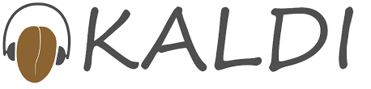

# TORGO-ASR
## Tutorial on using Kaldi for Dysarthric Speech Recognition.
### The data used is provided by the University of Toronto for free. 
- http://www.cs.toronto.edu/~complingweb/data/TORGO/torgo.html
- Speakers have speech impairments due to **Cerebral Palsy** or **Amyotrophic Lateral Sclerosis**.

### The goal of this excercise is to improve the recognition accuracy (lower the word-error rate) for moderate-severe dysarthria.
### Sections
- Part 1: [Installation](https://github.com/abnerLing/TORGO-ASR/tree/main/installation)
- Part 2: [Data Preparation](https://github.com/abnerLing/TORGO-ASR/tree/main/data%20prep)
- Part 3: Training & Evaluation
